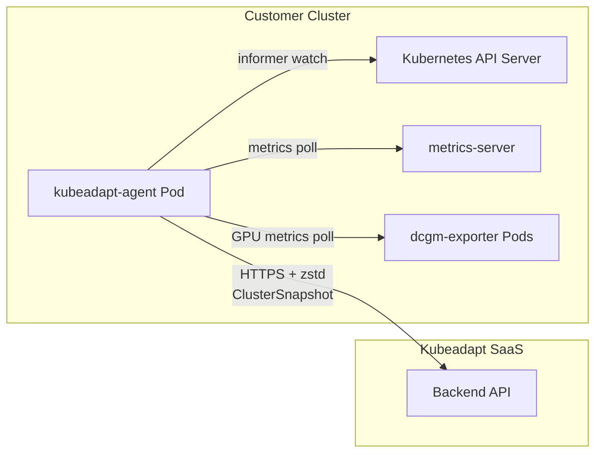
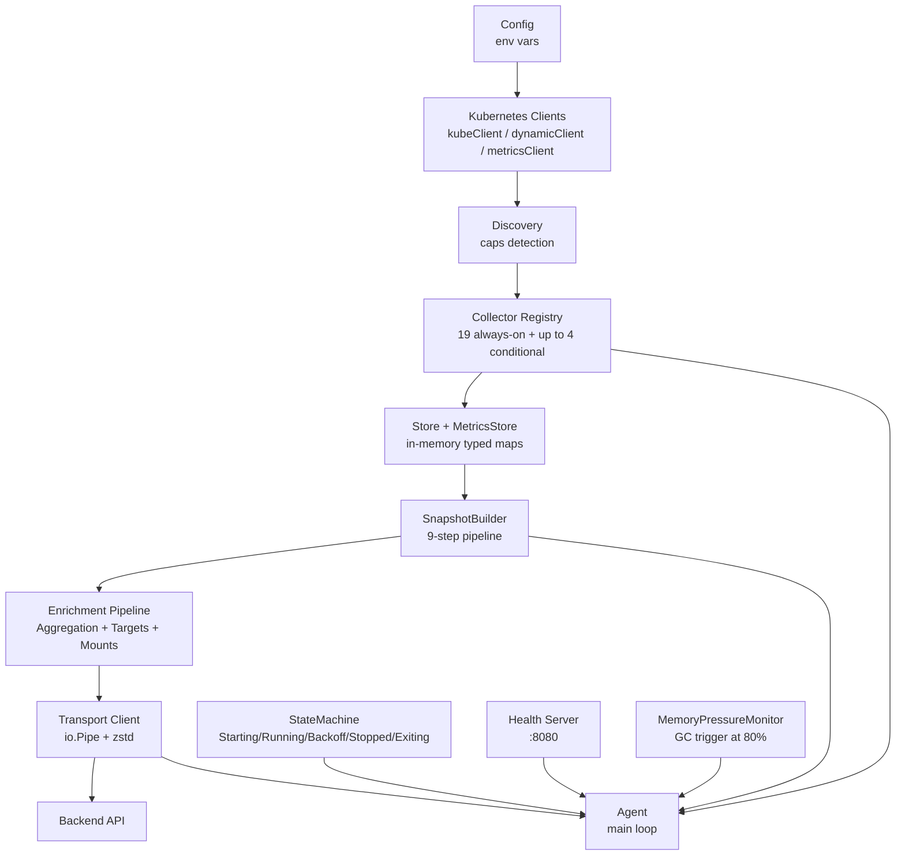
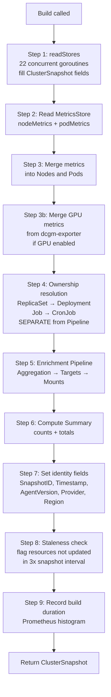
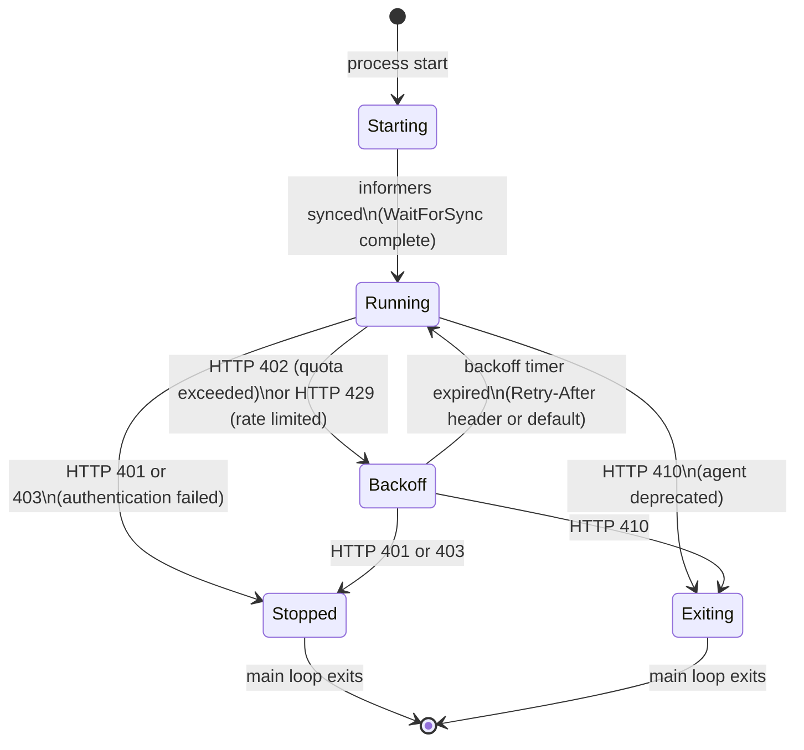

# Architecture

kubeadapt-agent is a lightweight Go binary that runs inside your Kubernetes cluster as a DaemonSet-adjacent deployment. It watches cluster state through the Kubernetes informer machinery, assembles periodic snapshots of every resource type, and streams them to the Kubeadapt SaaS backend over HTTPS with zstd compression.

This document covers the internal design: how components wire together, how the snapshot pipeline works, and how the agent manages its own lifecycle.

---

## High-Level Overview

The agent lives entirely inside the customer cluster. It never opens inbound ports for data (only a health/metrics port for liveness probes). All communication is outbound HTTPS to the Kubeadapt backend.



The backend is a black box from the agent's perspective. The agent sends a `ClusterSnapshot` JSON payload and receives a `SnapshotResponse` that may carry a state directive (e.g., back off, stop, exit). The agent never pulls configuration from the backend. All config comes from environment variables at startup.

---

## Internal Component Architecture

Startup wires 12 components in order. Each component has a single responsibility and communicates through typed interfaces rather than direct struct references.



### Component responsibilities

**Config** (`internal/config`): loads all settings from environment variables at startup. No dynamic reload. Validates required fields (API key, backend URL, cluster name) and exits immediately on invalid config.

**Kubernetes Clients** — three clients built from the in-cluster kubeconfig: `kubernetes.Clientset` for core resources, `dynamic.Interface` for CRDs (VPA, NodePool), and `metricsv1beta1.Interface` for the metrics-server API.

**Discovery** (`internal/discovery`): probes the cluster once at startup to detect optional capabilities: metrics-server, VPA, Karpenter NodePools, DCGM exporter, and cloud provider. The result gates which collectors get registered.

**Collector Registry** (`internal/collector`): holds all registered collectors and provides `StartAll`, `WaitForSync`, and `StopAll` lifecycle methods. Each collector implements the `Collector` interface:

```go
type Collector interface {
    Name() string
    Start(ctx context.Context) error
    WaitForSync(ctx context.Context) error
    Stop()
}
```

**Store + MetricsStore** (`internal/store`): thread-safe typed maps. Informer-based collectors write into `Store` on every watch event. The metrics-server collector writes into `MetricsStore`. The snapshot builder reads both stores concurrently.

**SnapshotBuilder** (`internal/snapshot`): assembles a `ClusterSnapshot` from the stores on each tick. See the [Snapshot Build Pipeline](#snapshot-build-pipeline) section for the full 9-step sequence.

**Enrichment Pipeline** (`internal/enrichment`): runs three enrichers in sequence after ownership resolution: `AggregationEnricher` (rolls up container metrics to pod/workload level), `TargetsEnricher` (attaches HPA/VPA targets to workloads), `MountsEnricher` (links PVCs to pods).

**Transport Client** (`internal/transport`): Serializes the snapshot to JSON and pipes it through a streaming zstd encoder directly into the HTTP request body. The informer store holds current cluster state in memory; no second in-memory buffer is created for transmission. Retries with exponential backoff on transient errors.

**StateMachine** (`internal/agent`): tracks the agent's lifecycle state and transitions it based on HTTP response codes from the backend. See the [State Machine](#state-machine) section.

**Health Server** (`internal/health`): HTTP server on port 8080 (configurable). Exposes `/healthz` (liveness), `/readyz` (readiness), `/metrics` (Prometheus), and optionally `/debug/pprof` when `KUBEADAPT_DEBUG_ENDPOINTS=true`.

**MemoryPressureMonitor**: polls runtime memory stats every 30 seconds. Triggers `runtime.GC()` when heap usage exceeds 80% of the container memory limit. Works in tandem with `automemlimit` (see [Runtime Tuning](#runtime-tuning)).

---

## Snapshot Build Pipeline

Every `SnapshotInterval` (default 60s), the agent calls `SnapshotBuilder.Build()`. The build runs 9 steps:



### Concurrent store reads

Step 1 spawns exactly 22 goroutines, one per resource type, all running in parallel behind a `sync.WaitGroup`:

| Goroutine | Resource |
|-----------|----------|
| 1 | Nodes |
| 2 | Pods |
| 3 | Namespaces |
| 4 | Deployments |
| 5 | StatefulSets |
| 6 | DaemonSets |
| 7 | Jobs |
| 8 | CronJobs |
| 9 | CustomWorkloads |
| 10 | HPAs |
| 11 | VPAs |
| 12 | PDBs |
| 13 | Services |
| 14 | Ingresses |
| 15 | PersistentVolumes |
| 16 | PersistentVolumeClaims |
| 17 | StorageClasses |
| 18 | PriorityClasses |
| 19 | LimitRanges |
| 20 | ResourceQuotas |
| 21 | NodePools |
| 22 | ReplicaSets (internal only, not in payload) |

ReplicaSets are read but not included in the snapshot payload. They're returned separately from `readStores()` and consumed only by the ownership enricher in Step 4.

### Ownership resolution (Step 4)

Ownership resolution runs as a standalone step before `Pipeline.Run()`. It's not part of the enrichment pipeline. The `OwnershipEnricher` walks the ReplicaSet list to resolve the two-hop ownership chain:

```
Pod → ReplicaSet → Deployment
Pod → Job → CronJob
```

This must happen before aggregation so that `AggregationEnricher` can group metrics by top-level owner (Deployment, StatefulSet, DaemonSet) rather than by intermediate controller.

### Streaming transport

After `Build()` returns, the agent calls `transport.Client.Send()`. The snapshot is never fully serialized into a `[]byte` buffer. Instead:

1. A `json.Encoder` writes to the write end of an `io.Pipe`.
2. A `zstd.Encoder` wraps the read end and compresses on the fly.
3. The HTTP request body reads from the zstd encoder.

All three stages run concurrently. Peak memory usage is proportional to the zstd window size, not the snapshot size.

---

## Informer-Based Watch Model

Collectors don't poll the Kubernetes API on a timer. They use the [client-go informer](https://pkg.go.dev/k8s.io/client-go/informers) pattern:

1. On `Start()`, each collector creates a shared informer for its resource type.
2. The informer establishes a long-lived watch connection to the API server.
3. On `Add`, `Update`, and `Delete` events, the collector's event handler writes the updated object into the `Store`.
4. `WaitForSync()` blocks until the informer's local cache has received the full initial list from the API server.

The agent waits for all informers to sync before transitioning to `StateRunning`. After that, the store always reflects the current cluster state. The snapshot builder reads a consistent point-in-time view by draining all stores concurrently in Step 1.

The informer resync period (default 30 minutes) triggers a full re-list from the API server to catch any missed events. This is a safety net, not the primary update mechanism.

---

## State Machine

The agent's lifecycle is modeled as a five-state machine. State transitions are driven by HTTP response codes from the backend, not by internal timers (except backoff expiry).



### State descriptions

**Starting**: initial state. Collectors are starting and syncing. No snapshots are sent. The agent is not yet marked ready.

**Running**: normal operation. The agent sends a snapshot on every tick. HTTP 200 from the backend keeps the state as Running.

**Backoff**: the backend asked the agent to slow down. HTTP 402 means quota exceeded; HTTP 429 means rate limited. The agent skips snapshot sends until the backoff timer expires. The `Retry-After` response header sets the backoff duration (default: 5 minutes for 402, 30 seconds for 429).

**Stopped**: the agent's credentials are invalid (HTTP 401) or forbidden (HTTP 403). The main loop exits cleanly. The pod will restart (depending on the restart policy) and re-authenticate on the next run.

**Exiting**: the backend returned HTTP 410, signaling that this agent version is deprecated and should not continue. The main loop exits. The pod should be upgraded via Helm.

### HTTP 5xx handling

Server errors (5xx) don't change state. The transport layer retries with exponential backoff. Only the state reason string is updated for observability. The agent continues sending on the next tick.

---

## Collector Inventory

| Collector | Type | Conditional |
|-----------|------|-------------|
| NodeCollector | informer | no |
| PodCollector | informer | no |
| NamespaceCollector | informer | no |
| DeploymentCollector | informer | no |
| StatefulSetCollector | informer | no |
| DaemonSetCollector | informer | no |
| ReplicaSetCollector | informer | no |
| JobCollector | informer | no |
| CronJobCollector | informer | no |
| HPACollector | informer | no |
| PDBCollector | informer | no |
| ServiceCollector | informer | no |
| IngressCollector | informer | no |
| PVCollector | informer | no |
| PVCCollector | informer | no |
| StorageClassCollector | informer | no |
| PriorityClassCollector | informer | no |
| LimitRangeCollector | informer | no |
| ResourceQuotaCollector | informer | no |
| VPACollector | informer | yes: VPA CRD present |
| NodePoolCollector | informer | yes: Karpenter CRD present |
| MetricsCollector | poll | yes — metrics-server present |
| GPUMetricsCollector | poll | yes — DCGM exporter detected |

The 19 always-on collectors cover the full Kubernetes resource model. The 4 conditional collectors activate only when the corresponding capability is detected at startup.

---

## Runtime Tuning

The agent imports two blank-identifier packages in `main.go` that tune the Go runtime for container environments:

**`go.uber.org/automaxprocs`** — sets `GOMAXPROCS` to match the container's CPU limit (from cgroups), not the host's CPU count. Without this, a container with a 0.5 CPU limit running on a 32-core host would spin up 32 OS threads, causing excessive scheduling overhead.

**`github.com/KimMachineGun/automemlimit`** — sets the Go runtime's soft memory limit (`GOMEMLIMIT`) to 90% of the container's memory limit. This lets the GC reclaim memory more aggressively before the OOM killer fires.

Together with the `MemoryPressureMonitor` (which triggers explicit GC at 80% heap usage), these three mechanisms keep the agent's memory footprint predictable in resource-constrained clusters.

---

## Package Map

```
cmd/agent/          — Entry point. 12-step component wiring, signal handling.
internal/
  agent/            — Agent main loop, StateMachine, MemoryPressureMonitor.
  collector/        — Collector interface, Registry, PartialStartError.
  config/           — Config struct, Load() from env, Validate().
  discovery/        — Cluster capability detection (VPA, Karpenter, metrics-server, DCGM).
  enrichment/       — Enricher interface, Pipeline, OwnershipEnricher,
                      AggregationEnricher, TargetsEnricher, MountsEnricher.
  errors/           — AgentError, ErrorCollector, error codes, Clock interface.
  health/           — HTTP health/readiness/metrics server.
  observability/    — Prometheus metrics registry (Metrics struct).
  resource/         — One collector per Kubernetes resource type (informer-based).
  snapshot/         — SnapshotBuilder, readStores, mergeMetrics, ComputeSummary.
  store/            — TypedStore[T] (thread-safe map), Store, MetricsStore.
  transport/        — HTTP client, io.Pipe + zstd streaming, retry logic.
pkg/
  model/            — ClusterSnapshot, all resource info structs, SnapshotResponse.
  gpu/              — DCGMExporterClient, GPUMetricsCollector.
```
